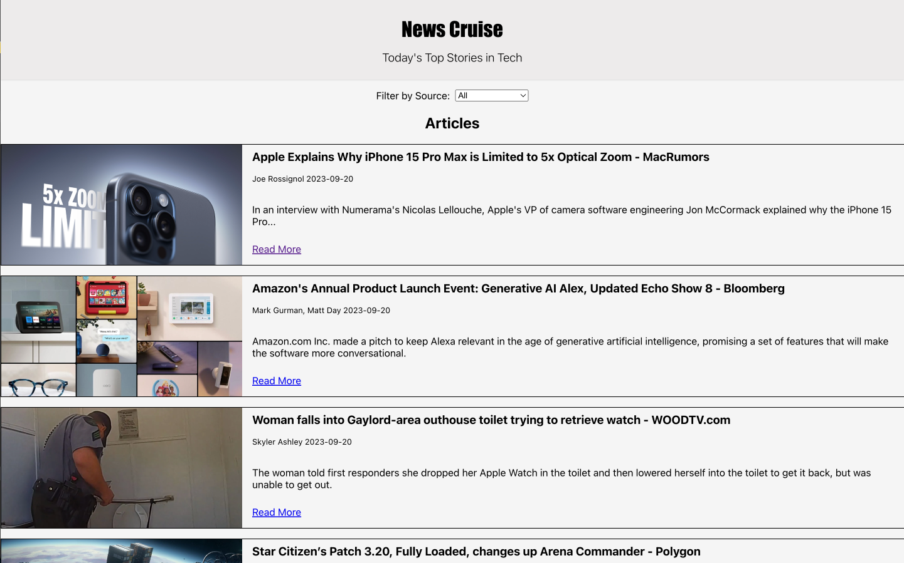
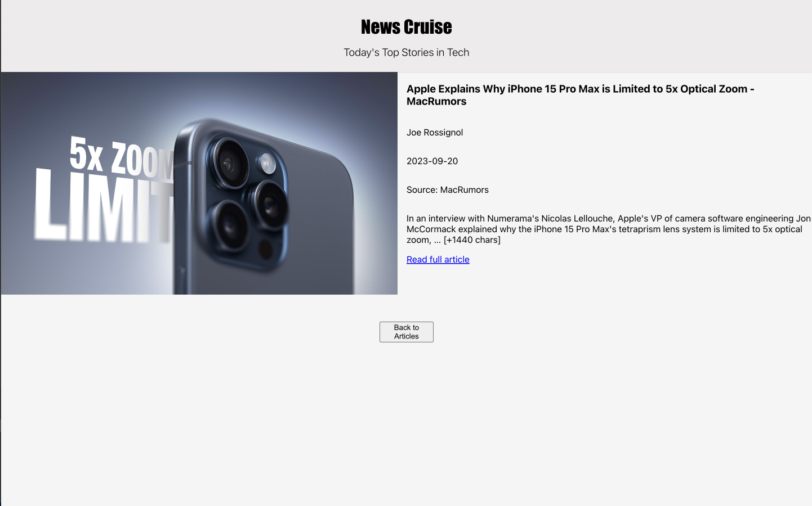
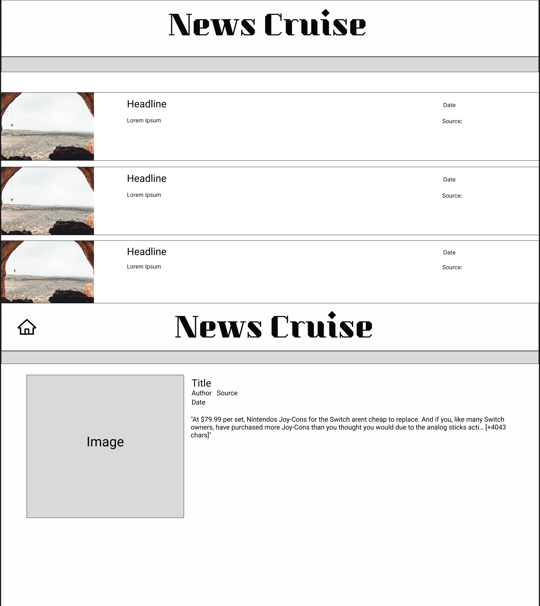
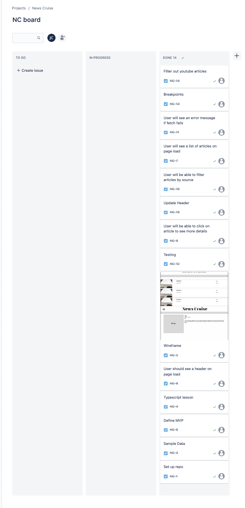

# News Cruise

## by Jamie Caudill

### DESCRIPTION

Built with React, Typescript, CSS, Cypress, React Router and HTML, News Cruise displays the current top stories in Tech. The detailed wireframe was created using Figma, and the project board was built using Jira. Users are able to scroll through the most recent headlines, click "Read more" to see more details, and click a link that will navigate them to the source of the article. News Cruise was built in under 8 hours.

### Preview

### LINKS

Project repo: [Github](https://github.com/JamieCaudill/news-cruise)

- React
- Typescript
- CSS
- HTML
- Npm
- Git
- Jira
- Figma

### Wireframe

### Project Board

### SETUP

1. Clone the repository to your local machine
1. `cd` into the project
1. Run `npm i` and `npm start`
1. Enjoy!

### CONTRIBUTORS

Jamie Caudill: <https://github.com/JamieCaudill>
